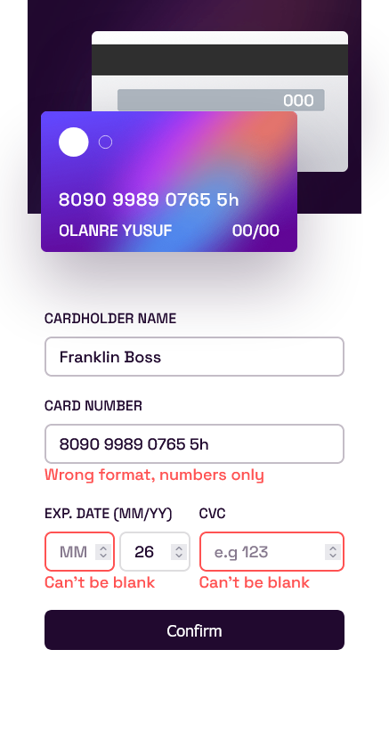

## Overview

Interactive card details form challenge on Frontend Mentor

### The challenge

Users will be able to:

- Fill in the form and see the card details update in real-time
- Receive error messages when the form is submitted if:
  - Any input field is empty
  - The card number, expiry date, or CVC fields are in the wrong format
- View the optimal layout depending on their device's screen size
- See hover, active, and focus states for interactive elements on the page

### Screenshot




### Links

- Solution URL: [Add solution URL here](https://your-solution-url.com)
- Live Site URL: [Add live site URL here](https://your-live-site-url.com)

## My process

A Mobile-first approach built with HTML, CSS and vanilla javascript

### Built with

- Semantic HTML5 markup
- CSS custom properties
- Flexbox
- CSS Grid
- Mobile-first workflow

### What I learned

Using Regex to add a space after 4 characters in the input field

```js
num.value
  .replace(/[^0-9A-Za-z]/g, "")
  .replace(/(.{4})/g, "$1 ")
  .trim();
```

### Continued development

This is a real perfect project to test my Javascript knowledge and i really learned many things and i'll continue learning more in the future

### Useful resources

- [Regex.text(string)](https://www.w3schools.com/jsref/jsref_regexp_test.asp) - This helped me in using simple chunk of code to get my error message popup. I really liked this pattern and will use it going forward.

## Author

- Designer - [Waliyyullah Olanrewaju Yusuf](olanrewajuyusuf280@gmail.com)
- Frontend Mentor - [@olanrewajuyusuf](https://www.frontendmentor.io/profile/olanrewajuyusuf)
- Twitter - [@WaliyyullahY](https://www.twitter.com/WaliyyullahY)

## Acknowledgments

To frontend mentor all the time, one million thanks...
